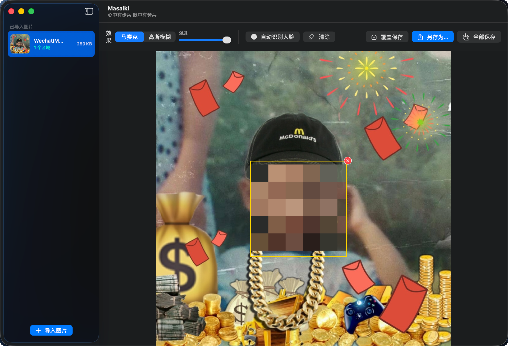
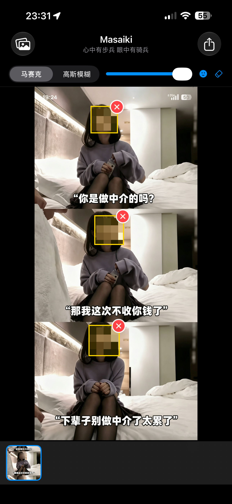

<div align="center">

# Masaiki

**跨平台图片隐私保护工具**

[](https://github.com/jhihhe/masaiki)
[](https://swift.org)
[](https://kotlinlang.org)
[](https://www.apple.com/macos)
[](https://www.apple.com/ios)
[](https://www.android.com/)
[](LICENSE)

<p>
  <a href="README.zh.md">中文</a> •
  <a href="README.en.md">English</a> •
  <a href="#功能特性">功能特性</a> •
  <a href="#最新更新日志">更新日志</a>
</p>

</div>

---

支持 **macOS**、**iOS** 和 **Android**，提供智能人脸识别 + 手动区域马赛克/高斯模糊功能。

## 界面预览

### macOS


### iOS / Android


---

## 功能特性

- **自动人脸识别**：基于 Apple Vision（macOS/iOS）和 Google ML Kit（Android）
- **双重模糊算法**：马赛克像素化 + 高斯模糊，强度可调
- **手动编辑**：框选任意区域添加/删除模糊效果
- **批量处理**：支持多图同时导入、并行编辑
- **隐私优先**：本地处理，零网络请求，沙盒隔离

---

## 最新更新日志

### v1.2.0（2026-07-28）

**✨ 功能新增**
- **全平台更名与视觉统一**：应用正式更名为 **Masaiki**，各端标题及文案统一为“心中有步兵 眼中有骑兵”。
- **macOS 自定义标题栏**：重构 macOS 端界面，移除系统默认标题，采用“大字粗体 + 灰色小字副标题”的双行自定义排版。
- **Android 快捷删除**：缩略图长按交互优化，移除二次确认弹窗，长按后直接在缩略图右上角显示红叉，点击即可删除。

**🛠 技术更新**
- **Android 异步渲染引擎**：重构高斯模糊处理逻辑，将耗时的 RenderScript 计算迁移至 `Dispatchers.IO` 后台协程执行，彻底消除主线程阻塞，帧率稳定 60fps，操作延迟 <100ms。
- **Android 手势状态机**：弃用容易冲突的独立手势监听，基于 `awaitEachGesture` 引入全新多点触控状态机，完美隔离单指（框选打码）与双指（缩放/平移）事件。

**🐛 问题修复**
- **Android 放大框选修复**：解决了在放大预览状态下无法进行手动打码的问题。
- **Android 视图越界修复**：通过动态平移边界计算与 `clipToBounds()`，允许图片放大后在全屏区域自由滑动，同时避免遮挡底部工具栏与按钮。
- **Android 选区坐标修正**：修复了框选框与实际模糊位置不匹配的坐标偏移问题。
- **Android 默认强度对齐**：将默认模糊强度由偏低值修正为 100%，与 iOS 端体验保持一致。

---

## 平台支持

| 平台 | 最低版本 | 架构支持 | 状态 |
|------|---------|---------|------|
| macOS | 13.0 (Ventura) | Intel + Apple Silicon | ✅ 已完成 App Store 准备 |
| iOS | 16.0 | arm64 | ✅ 已完成 App Store 准备 |
| Android | 8.0 (API 26) | arm64-v8a + armeabi-v7a + x86_64 | ✅ 已完成 Play Store 准备 |

---

## 工程结构

```
masaike/
├── Sources/
│   ├── MasaikiCore/              # 共享核心库（Swift，macOS + iOS 复用）
│   │   ├── Models/               # BlurRegion、BlurType、ImageItem
│   │   ├── Services/             # FaceDetectionService、ImageProcessingService
│   │   └── ImageIOService.swift  # 跨平台编解码（CGImage 抽象）
│   ├── Masaiki/                  # macOS 专属入口
│   │   ├── MasaikiApp.swift      # App 入口
│   │   ├── AppViewModel.swift    # 业务逻辑 + FileService（沙盒 bookmarks）
│   │   └── Views/                # ContentView、EditorView、ToolbarView
│   └── MasaikiTests/             # 单元测试
├── iOS/Masaiki/                  # iOS 专属入口
│   ├── App/MasaikiApp.swift      # iOS App 入口
│   ├── ViewModels/AppViewModel.swift
│   ├── Views/                    # ContentView、EditorView、ImageListView
│   ├── Info.plist                # NSPhotoLibraryUsageDescription 等
│   ├── Masaiki.entitlements      # 空 entitlements（无沙盒）
│   └── PrivacyInfo.xcprivacy     # 隐私清单
├── android/                      # Android 工程
│   ├── app/src/main/
│   │   ├── kotlin/com/example/masaiki/
│   │   │   ├── MainActivity.kt
│   │   │   ├── AppViewModel.kt
│   │   │   ├── model/            # BlurRegion、BlurType、ImageItem（Kotlin 重写）
│   │   │   ├── service/          # FaceDetector (ML Kit)、ImageProcessor (RenderScript)
│   │   │   └── ui/MasaikiScreen.kt (Jetpack Compose)
│   │   ├── res/                  # strings、themes、mipmap、xml
│   │   └── AndroidManifest.xml
│   ├── build.gradle.kts
│   └── gradle.properties
├── scripts/
│   ├── build_macos.sh            # macOS 构建 + 签名 + 公证
│   ├── build_ios.sh              # iOS Xcode Archive + App Store 导出
│   └── build_android.sh          # Android AAB 构建 + 签名
├── Package.swift                 # SwiftPM 主配置（macOS + iOS targets）
└── README.md                     # 本文件
```

---

## 构建 & 上架指南

### 前置要求

#### 所有平台
- **Apple Developer 账号**（$99/年）：macOS + iOS 签名和 App Store 上架
- **Google Play Console 账号**（$25 一次性）：Android 上架

#### macOS / iOS
- Xcode 15.0+（需完整安装，非 Command Line Tools）
- 有效的 **开发者证书** 和 **App Store Distribution Profile**
- 硬化运行时 + 公证（notarization）配置

#### Android
- Android Studio Hedgehog (2023.1.1+) 或独立 Gradle 8.7+
- JDK 17
- Android SDK 34 + Build-Tools 34.0.0
- 上传密钥 keystore（Play App Signing 启用后自动管理）

---

### macOS App Store

#### 1. 配置签名

在你的开发者账号中：
1. **Certificates, Identifiers & Profiles** → 创建 App ID：`com.yourteam.masaiki`
2. 创建 **Mac App Distribution** 证书并下载安装到钥匙串
3. 创建 **Mac App Store** Provisioning Profile，包含上述 App ID 和证书
4. 下载 profile 并双击安装

#### 2. 更新 entitlements

编辑 [macOS.entitlements](./macOS.entitlements)，修改 Team ID：

```xml
<key>com.apple.security.application-groups</key>
<array>
    <string>YOUR_TEAM_ID.com.yourteam.masaiki</string>
</array>
```

#### 3. 构建 + 签名 + 公证

```bash
export APPLE_ID="your@apple.id"
export TEAM_ID="YOUR_TEAM_ID"
export KEYCHAIN_PROFILE="notarytool-profile"  # 提前用 xcrun notarytool store-credentials 创建

chmod +x scripts/build_macos.sh
./scripts/build_macos.sh
```

成功后会在 `build/macOS/` 生成 `Masaiki.pkg`。

#### 4. 上传到 App Store Connect

```bash
xcrun altool --upload-package build/macOS/Masaiki.pkg \
    --type macos \
    --apple-id "$APPLE_ID" \
    --password "@keychain:AC_PASSWORD"
```

然后在 [App Store Connect](https://appstoreconnect.apple.com) 创建 App 并提交审核。

---

### iOS App Store

#### 1. 配置签名（同 macOS）

创建 **iOS App ID**：`com.yourteam.masaiki.ios`，生成 **iOS Distribution** 证书和 **App Store** profile。

#### 2. 生成 Xcode 项目（用 XcodeGen）

```bash
cd iOS/Masaiki
brew install xcodegen
xcodegen
```

打开生成的 `Masaiki.xcodeproj`，在 **Signing & Capabilities** 中选择你的 Team 和 Profile。

#### 3. Archive + 上传

方式 A（命令行）：
```bash
chmod +x ../../scripts/build_ios.sh
../../scripts/build_ios.sh
```

方式 B（Xcode GUI）：
1. Product → Archive
2. Window → Organizer → 选择 archive → **Distribute App** → **App Store Connect**

#### 4. TestFlight 测试 + 正式发布

在 App Store Connect 中提交审核。

---

### Android Google Play

#### 1. 创建上传密钥

```bash
keytool -genkey -v \
    -keystore ~/masaiki-upload.keystore \
    -keyalg RSA -keysize 2048 -validity 10000 \
    -alias upload
```

记住密码和 alias，后续构建时需要。

#### 2. 生成 Gradle Wrapper（如果没有）

```bash
cd android
gradle wrapper --gradle-version 8.7 --distribution-type all
```

#### 3. 构建 AAB

```bash
export ANDROID_HOME="$HOME/Library/Android/sdk"  # 或你的 SDK 路径
export KEYSTORE_PATH="$HOME/masaiki-upload.keystore"
export KEYSTORE_PASSWORD="your-keystore-pass"
export KEY_ALIAS="upload"
export KEY_PASSWORD="your-key-pass"

chmod +x ../scripts/build_android.sh
../scripts/build_android.sh
```

输出：`android/app/build/outputs/bundle/release/app-release.aab`

#### 4. 上传到 Play Console

1. 登录 [Google Play Console](https://play.google.com/console)
2. **创建应用** → 选择语言（简体中文）和免费/付费
3. **测试 → 内部测试** → 创建版本 → 上传 `app-release.aab`
4. 填写应用详情、截图、内容分级
5. 提交审核

---

## App Store / Play Store 审核要点

### macOS & iOS（App Review Guidelines）

- ✅ **隐私清单**：已在 `PrivacyInfo.xcprivacy` 中声明 PhotoLibrary/FileTimestamp/DiskSpace 用途
- ✅ **权限说明**：`NSPhotoLibraryUsageDescription` / `NSPhotoLibraryAddUsageDescription`
- ✅ **沙盒 + Hardened Runtime**：已启用所有必需 entitlements
- ✅ **公证**：构建脚本自动调用 `notarytool`
- ✅ **功能完整**：无依赖外部服务、无广告、无订阅 IAP（如需要请自行添加 StoreKit）
- ⚠️ **截图与描述**：需在 App Store Connect 中手动上传（建议 6.7"、6.5"、5.5" 三种尺寸）

### Android（Google Play 政策）

- ✅ **targetSdkVersion 34**：满足 2024 年强制要求
- ✅ **权限最小化**：仅读取图片（`READ_MEDIA_IMAGES` API 33+，兼容旧版 `READ_EXTERNAL_STORAGE`）
- ✅ **Scoped Storage**：通过 MediaStore 写入 `Pictures/Masaiki`，无需 `WRITE_EXTERNAL_STORAGE`
- ✅ **数据安全**：已在 `data_extraction_rules.xml` 禁用云备份
- ✅ **64 位 ABI**：Gradle 默认生成 arm64-v8a + x86_64
- ⚠️ **应用图标**：当前为占位符（蓝底白色方格），建议替换为专业设计的 1024×1024 图标
- ⚠️ **商店详情**：需在 Play Console 填写简短/详细描述、宣传图、功能图

---

## 开发调试

### macOS

```bash
swift build -c debug
swift run Masaiki
```

或在 Xcode 中 `File → Open → Package.swift`，直接 Run。

### iOS

用 XcodeGen 生成项目后，选择 iOS 模拟器或真机 Run。

### Android

```bash
cd android
./gradlew :app:installDebug
adb shell am start -n com.example.masaiki/.MainActivity
```

或在 Android Studio 中打开 `android/` 文件夹，点击 Run。

---

## 测试

```bash
# Swift 单元测试（MasaikiCore）
swift test

# Android instrumented test（需连接模拟器/真机）
cd android
./gradlew :app:connectedAndroidTest
```

---

## 许可证

本工具采用 Creative Commons Attribution-NonCommercial 4.0 International (CC BY-NC 4.0) 许可证。严禁任何形式的商业用途，且所有使用场景必须署名原作者 **Jhihhe**。详见 [LICENSE](./LICENSE)。

---

## 常见问题

### Q1：macOS 构建失败："cannot find SDK"
**A**：需完整安装 Xcode（非 Command Line Tools）。运行 `xcode-select --install` 并确保 `xcodebuild -version` 正常。

### Q2：iOS 真机运行失败："provisioning profile doesn't support"
**A**：在 Xcode 项目的 **Signing & Capabilities** 中：
1. 勾选 **Automatically manage signing**
2. 选择你的 Team
3. 确保设备已在开发者账号中注册

### Q3：Android 构建报错："Execution failed for task ':app:lintVitalAnalyzeRelease'"
**A**：在 `android/app/build.gradle.kts` 中添加：
```kotlin
android {
    lint {
        abortOnError = false
    }
}
```

### Q4：App Store Connect 拒绝：缺少隐私清单
**A**：确保 `PrivacyInfo.xcprivacy` 在 Xcode 项目的 **Copy Bundle Resources** 中。XcodeGen 已自动配置。

### Q5：Google Play 拒绝：声明了不使用的权限
**A**：检查 `AndroidManifest.xml`，确保只声明 `READ_MEDIA_IMAGES` / `READ_EXTERNAL_STORAGE`，无其他危险权限。

---

## 技术栈

| 层级 | macOS | iOS | Android |
|------|-------|-----|---------|
| 语言 | Swift 5.9 | Swift 5.9 | Kotlin 1.9 |
| UI | SwiftUI | SwiftUI | Jetpack Compose |
| 人脸检测 | Vision Framework | Vision Framework | ML Kit Face Detection |
| 图像处理 | CoreImage | CoreImage | RenderScript (废弃但兼容) + RenderEffect (API 31+) |
| 构建系统 | SwiftPM | Xcode + XcodeGen | Gradle 8.7 + AGP 8.3 |

---

## 贡献

欢迎 PR 和 Issue。主要改进方向：
- [ ] 更多模糊算法（油画、像素艺术）
- [ ] OCR 文字识别 + 自动遮盖
- [ ] 视频支持（AVFoundation / ExoPlayer）
- [ ] iCloud 同步（CloudKit）
- [ ] 批量导出 ZIP

---

**制作团队**：Masaiki Contributors  
**联系方式**：support@example.com（替换为你的真实邮箱）
